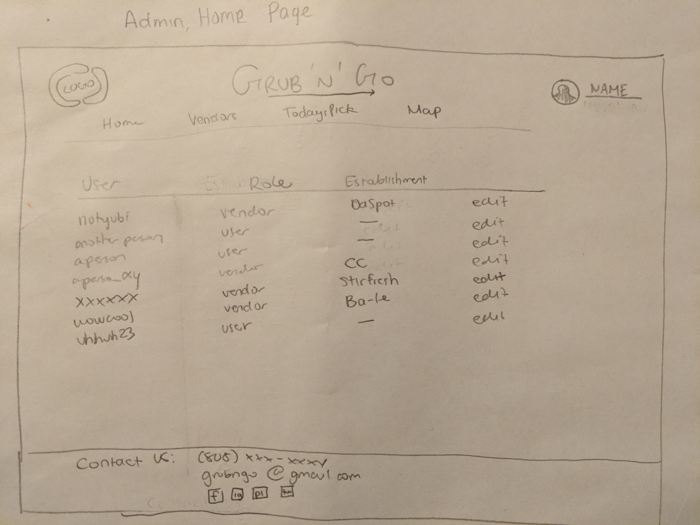

# Table of contents

* [About Grub 'n' Go](#about)
* [Installation](#installation)
* [Development history](#development-history)
  * [Milestone 1: Mockup development](#milestone-1-mockup-development)
  * [Milestone 2: Data model development](#milestone-2-data-model-development)

# About 

Grub 'n' Go is a Meteor application allowing users a convenient way to see available dining options/menus on campus. When you come to the site, you are greeted by the following landing page:


Anyone with a UH account can login to Grub 'n' Go by clicking on the login button. The UH CAS authentication screen then appears and requests your UH account and password:
 
 
Once authenticated, you can create a profile that provides a biographical statement and list of interests, plus links to selected social media sites (GitHub, FaceBook, Instagram):

  
After creating a profile, you will be listed on the public directory page:


Grub 'n' Go also provides a filter page, available to those who can login to the system with their UH account. The filter page allows you to display all portfolios with a given interest:

There is also an admin page where the admin has access to view all users and vendors. Here, the admin can edit who is a user and who is a vendor. For easy navigation, corresponding establishment, if applicable, if shown as well:




# Installation

First, [install Meteor](https://www.meteor.com/install).

Second, [download a copy of GrubNGo](https://github.com/internationalhawaiioccupiersprogram/grubngo/archive/master.zip), or clone it using git.
  
Third, cd into the app/ directory and install libraries with:

```
$ meteor npm install
```

Fourth, run the system with:

```
$ meteor npm run start
```

If all goes well, the application will appear at [http://localhost:3000](http://localhost:3000). If you have an account on the UH test CAS server, you can login.  

# Development History

## Milestone 1: Mockup development

This milestone started on April 2nd, 2018 and ended on April 12th, 2018.

The goal of Milestone 1 was to create the functional requirements for our application which includes: having our system deployed to Galaxy, have a landing page (with a login) and mockups of at least four other pages. Additionally there are software engineering requirements that includes using GitHub issues and a GitHub project called "M1" and practicing Issue Driven Project Management strategies. Lastly, there are home page requirements for our project's github home page. This includes (but not limited to): a link to the Github organization of this project, up-to-date screenshots, link to the running deployment of our system on Galaxy, link to the M1 project page and a link to the M2 project page.

Mockups for the following four pages were implemented during M1:


Milestone 1 was implemented as [Grub 'n' Go GitHub Milestone M1]((https://github.com/internationalhawaiioccupiersprogram/GrubNGo/projects/1)::


Milestone 1 consisted of five issues, and progress was managed via the [Grub 'n' Go GitHub Project M1](https://github.com/internationalhawaiioccupiersprogram/GrubNGo/projects/1):


Each issue was implemented in its own branch, and merged into master when completed:


## Milestone 2: Data model development 

This milestone started on April 13th, 2018 and ended on April 24th, 2018.

The goal of Milestone 2 was to significantly improve the functionality and quality of our application beyond the first M1 and improve our software engineering process beyond M1.

Additionally, we had to find at least 5 UH community members to test our application and give feedback and update our organization's GitHub page to document the current version of our system.

Milestone 2 was implemented as [Grub 'n' Go GitHub Milestone M2](https://github.com/internationalhawaiioccupiersprogram/GrubNGo/projects/2)


Milestone 2 consisted of two issues, and progress was managed via the [Grub 'n' Go GitHub Project M2](https://github.com/internationalhawaiioccupiersprogram/GrubNGo/projects/2):


